# Quizle

Quizle is a quiz website offering quizzes on a variety of topics for users to test their knowledge. The format of the quizzes is a list of 10 items in a specific category and the user has to guess them all within a given time limit. The main purpose of the website is to be a source of entertainment for users but also offers the functionality for users to create quizzes to challenge their friends with.

The front end of the website was built using ReactJS and the back end was built using the Django Rest API framework. This readme focuses on the front end.

The goals of the website are:

**Site Owner**

- To create a fun and interactive website that users can use as a source of entertainment
- To enable users to complete a variety of quizzes to test their knowledge in a fun way
- To enable users to create quizzes that they can share with others
- To enable users to interact with the website in a social way

**Site Users**

- To play a variety of quizzes for entertainment purposes
- To be able create quizzes that can be shared with others
- To be able to interact with the website by leaving comments and updating profile information
- To be able to keep track of the quizzes they have created/completed
- To have a quick and responsive user experience, with easy navigation

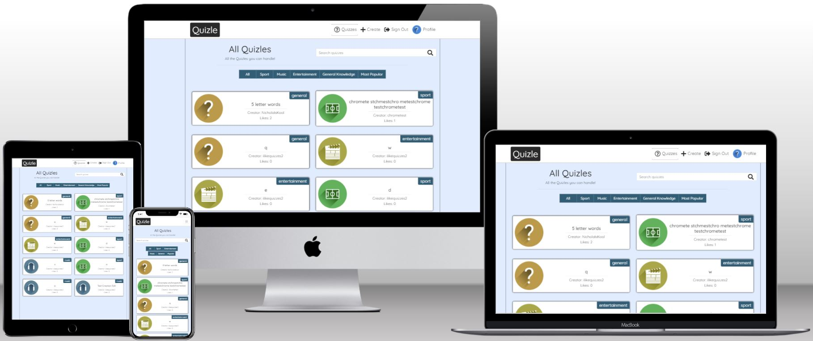

## Live Site

The live site for the front end can be found [here](https://quizle-ah.herokuapp.com/).

The live site for the back end can be found [here](https://quizle-drf-api.herokuapp.com/).

The repository for the back end can be found [here](https://github.com/adamhatton/quizle-drf-api).

## Table of Contents

- [Agile Methodology](<#agile-methodology>)
	- [Feasibility Matrix](<#feasibility-matrix>)
	- [Epics and User Stories](<#epics-and-user-stories>)
		- [Navigation & Authentication](<#navigation-and-authentication>)
		- [Enable Profiles and Profile Editing](<#enable-profiles-and-profile-editing>)
		- [Enable users to play quizzes](<#enable-users-to-play-quizzes>)
		- [Enable users to create quizzes](<#enable-users-to-create-quizzes>)
		- [Enable users to track scores](<#enable-users-to-track-scores>)
		- [Enable users to like quizzes](<#enable-users-to-like-quizzes>)
		- [Enable comment functionality](<#enable-comment-functionality>)
	- [Acceptance Criteria](<#acceptance-criteria>)
	- [Tasks](<#tasks>)
	- [User Story Management](<#user-story-management>)
	- [Sprints](<#sprints>)
		- [Sprint One](<#sprint-one>)
		- [Sprint Two](<#sprint-two>)
- [Features](<#features>)
	- [Quizzes Page](<#quizzes-page>)
		- [Navbar](<#navbar>)
		- [Search Bar](<#search-bar>)
		- [Filter Buttons](<#filter-buttons>)
		- [Quiz Tiles](<#quiz-tiles>)
	- [Quiz Creation](<#quiz-creation>)
		- [Create Quiz](<#create-quiz>)
		- [Edit Quiz](<#edit-quiz>)
	- [Quiz Page](<#quiz-page>)
		- [Quiz Info](<#quiz-info>)
		- [Quiz Dropdown](<#quiz-dropdown>)
		- [Guess Input](<#guess-input>)
		- [Controls and Timer](<#controls-and-timer>)
		- [Answer Table](<#answer-table>)
		- [Likes Icon](<#likes-icon>)
		- [Comments Icon](<#comments-icon>)
		- [Comments](<#comments>)
	- [Profile Page](<#profile-page>)
		- [Profile Info](<#profile-info>)
		- [Created and Completed Quizzes](<#created-and-completed-quizzes>)
		- [Edit Profile](<#edit-profile>)
		- [Edit Username](<#edit-username>)
		- [Edit Password](<#edit-password>)
		- [Sign Up](<#sign-up>)
		- [Sign In](<#sign-in>)
	- [General Features](<#general-features>)
		- [Security](<#security>)
		- [General](<#general>)
		- [404](<#404>)
- [Design](<#design>)
	- [Colours](<#colours>)
	- [Typography](<#typography>)
	- [Imagery](<#imagery>)
	- [Wireframes](<#wireframes>)
- [Database Schema](<#database-schema>)
- [React](<#react>)
	- [Components](<#components>)
	- [Libraries](<#libraries>)	
- [Technologies](<#technologies>)
	- [Development Technologies](<#development-technologies>)
	- [Testing Technologies](<#testing-technologies>)
- [Testing](<#testing>)
	- [Manual Testing](<#manual-testing>)
	- [Validation](<#validation>)
- [Bugs and Issues](<#bugs-and-issues>)
	- [QuizTile Sizing](<#quiztile-sizing>)
	- [Multiple Score Creation Requests](<#multiple-score-creation-requests>)
	- [Timer Running Out Bug](<#timer-running-out-bug>)
	- [Delete Quiz Redirection Bug](<#delete-quiz-redirection-bug>)
- [Deployment](<#deployment>)
	- [ReactJS](<#reactjs>)
	- [Heroku](<#heroku>)
- [Credits and Resources](<#credits-and-resources>)
	- [Code](<#code>)
	- [Learning Resources](<#learning-resources>)
		- [Videos](<#videos>)
		- [Websites](<#websites>)
	- [Content](<#content>)
	- [Media](<#media>)
	- [Acknowledgements](<#acknowledgements>)

## Agile Methodology

An Agile methodology was used throughout the planning and development of the website, in this section I will explain the different tools that I used and the tasks that I completed to ensure I was working in an Agile way.

### Feasibility Matrix

At the start of the project, I listed out all the potential goals of the website. I then assigned each goal (or opportunity) an importance and viability score which enabled me to create a feasibility matrix as below:

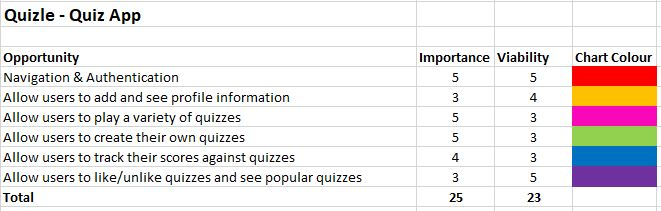

Plotting the table onto a chart helped me see which elements were most important and where my efforts needed to be focused:

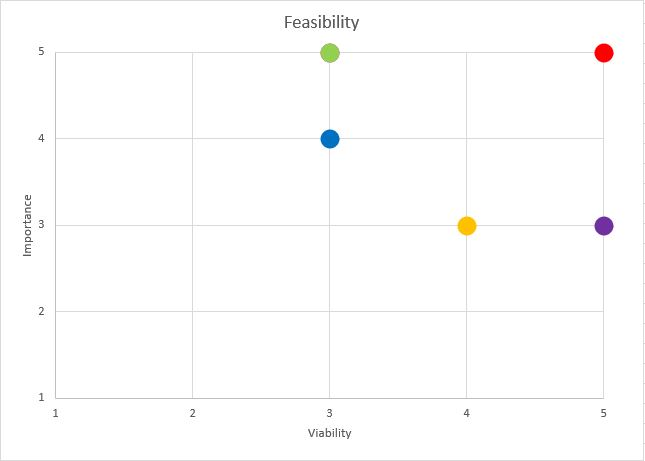

This work enabled me to see that importance was greater than viability so it was likely that I wouldn't be able to implement everything so at this point I decided to deprioritise the 'like' functionality, and this is reflected in the User Story importance rating. However, during development I managed to implement certain features quicker than anticipated which gave me the time to implement 'like' functionality. Not only this, I was also able to implement an Epic that I had not originally considered, which was the ability for users to add comments.

The feasibility matrix can also be seen in the [associated excel document](docs/project/user-stories-and-feature-prep.xlsx), on the tab named 'Feasibility Matrix'.

### Epics and User Stories

Following the feasibility matrix, I used the opportunities to determine what my Epics were, which meant that I had the following (note that the comments Epic was not in the original scope):

- Navigation & Authentication
- Enable Profiles and Profile Editing
- Enable users to play quizzes
- Enable users to create quizzes
- Enable users to track scores
- Enable users to like/unlike quizzes
- Enable comment functionality

I then broke each Epic down into User Stories:

- #### Navigation and Authentication
- Navigation: As a site user I can view a navbar from every page so that I can navigate easily between pages
- Routing: As a site user I can navigate through pages quickly so that I can view content seamlessly without page refresh
- Authentication - Sign up: As a site user I can create a new account so that I can access all the features for signed up users
- Authentication - Sign in: As a site user I can sign in to the app so that I can access functionality for logged in users
- Authentication - Logged in Status: As a site user I can tell if I am logged in or not so that I can log in if I need to
- Authentication - Refreshing access tokens: As a site user I can maintain my logged-in status until I choose to log out so that my user experience is not compromised

These stories were implemented to achieve the project goal of a quick and responsive user experience, with easy navigation.

- #### Enable Profiles and Profile Editing
- Profile Page: As a site user, I can see other users profiles so I can see any quizzes they have made and their profile information
- Edit Profile: As a logged in site user, I can see and edit my own profile so that I can change my bio
- Update username and password: As a logged in site user, I can update my username and password so that I can change my display name and keep my profile secure

These stories were implemented to achieve the project goal of allowing users to interact with the website by updating profile information.

- #### Enable users to play quizzes
- Quizzes Page: As a site user, I can see all the available quizzes so that I can choose which one I want to do
- Infinite Scroll: As a site user, I can keep scrolling through the available quizzes that are loaded for me automatically so that I don't have to click on "next page" etc
- Quiz Search: As a site user, I can search the quizzes using keywords so that I can find specific quizzes
- Quiz Filters: As a site user, I can filter quizzes by category so that I can find quizzes in categories that interest me
- Quiz Selection: As a site user, I can select a quiz so that I can see the information about it and complete it
- Play State Timer: As a site user, I can start a quiz so that I can begin a countdown timer for my responses
- Play State Guesses: As a site user, I can enter my guesses into a text input so that they can be checked against the answers
- Play State Feedback: As a site user, I am given immediate feedback on my guesses so that I can see whether they are corrrect or not
- Play State Missing Answers: As a site user, I can see the answers to the quiz once the timer ends so I can see any that I missed

These stories were implemented to achieve the project goal of allowing users To play a variety of quizzes for entertainment purposes.

- #### Enable users to create quizzes
- Quiz Creation Page: As a logged in site user, I can create a quiz so that I can provide new challenges for other users
- Quiz Creation Instructions: As a logged in site user, I can see instructions for creating a quiz so that I can know what information is needed
- Quiz Creation Fields: As a logged in site user, I can set the hints, answers and time limit so that I can control how difficult the quiz is
- Edit Quiz: As a logged in site user, I can edit any quizzes I have created so that I can keep them up to date
- Delete Quiz: As a logged in site user, I can delete any quizzes I have created so that I can control the content I have provided

These stories were implemented to achieve the project goal of allowing users to create quizzes that they can share with others.

- #### Enable users to track scores
- Fastest Times: As a logged in user, I can see my fastest time on any quizzes I have completed, so that I know how quickly I have previously completed a quiz
- Stats: As a logged in user, I can see how many quizzes I have successfully completed, so that I can keep track of my efforts

These stories were implemented to achieve the project goal of allowing users to be able to keep track of the quizzes they have created/completed.

- #### Enable users to like quizzes
- Popular Quizzes Page: As a site user, I can see a list of the most liked quizzes so that I can see which quizzes a popular
- Like a quiz: As a logged in user I can like a quiz so that I can show my support for the quizzes that interest me
- Unlike a quiz: As a logged in user I can unlike a quiz so that I can amend likes if I change my mind

These stories were implemented to achieve the project goal of allowing users to interact with the website in a social way.

- #### Enable comment functionality
- Create a comment: As a logged in user I can add comments to a quiz so that I can share my thoughts about the quiz
- Comment date: As a user I can see how long ago a comment was made so that I know how old a comment is
- View comments: As a user I can see comments on quizzes so that I can read what other users think about the quizzes
- Delete comments: As an owner of a comment I can delete my comment so that I can control removal of my comment from the application
- Edit a comment: As an owner of a comment I can edit my comment so that I can fix or update my existing comment

These stories were implemented to achieve the project goal of allowing users to interact with the website by leaving comments.

Using the MoSCoW method, I assigned each story a priority to help me determine the order of development (note that as the Comment functionality wans't originally in scope, these were all given a priority of 'Should Have' as new backlog items).

The Epics, User Stories and associated MoSCoW/story points can also be seen in the [associated excel document](docs/project/user-stories-and-feature-prep.xlsx), on the tab named 'User Stories'.

### Acceptance Criteria

Once I had my User Stories, I worked through these to break them down into Acceptance Criteria. The purpose of this was to provide a reference point for the development to ensure that what was being implemented is actually what was needed. It also helped with Testing to ensure that all necessary scenarios were covered.

I have provided an example of some acceptance criteria below, the full list for each user story can be seen in the [associated excel document](docs/project/user-stories-and-feature-prep.xlsx), on the tab named 'User Story AC'.

**Play State Timer: As a site user, I can start a quiz so that I can begin a countdown timer for my responses**
- When a user presses the 'start quiz' button, a timer should start counting down to indicate the quiz has started
- The guess input box should become active when the quiz has started
- The timer should be reset if the user refreshes the page
- If a user completes the quiz before the timer runs out, the timer should pause
- If the timer runs out before the quiz is completed, it should change to a button that says "Reset"
- Pressing the "Reset" button should refresh the quiz and the timer back to the beginning

### Tasks

When working on each User Story, I broke them down into Tasks to identify the technical work required to implement the story. This helped keep the development focussed as well as ensuring I didn't miss any technical elements.

I have provided an example of the tasks for a User Story below, the full list for each user story can be seen on the project board by accessing the user stories themselves: https://github.com/users/adamhatton/projects/4.

**Authentication - Sign up: As a site user I can create a new account so that I can access all the features for signed up users**
- Install axios and add axios defaults
- Create signup form component
- Add signup form css module and styles
- Add signup form change handler
- Add API call for submitting form

### User Story Management

To manage the User Stories for the project, I created a Github Project with a Kanban board, which can be seen here: https://github.com/users/adamhatton/projects/4

Each of the stories was added to the project using a User Story template, and then allocated to the relevant column.
All the other stories were put into the 'To Do' column, being moved into the 'In Progress' column when they were in development, and then moving into 'Testing' once the development was complete. All of the stories that were tested were moved into the 'Done' column.

Using this tool helped me to keep track of the status of each story, as well as keeping on top of how many stories were left to complete.

### Sprints

The delivery of user stories was done based on the Epics, with each Epic being allocated to a sprint. Development commenced on the 11th of November and was broken into two 1-week sprints to help track the progress of the project.

#### Sprint One

Sprint one focused on the following Epics/Milestones:

- Navigation & Authentication
- Enable users to create quizzes
- Enable users to play quizzes

These 3 Epics made up the core of the website and represented the bulk of the key development work, as such these were added to the first sprint. Completing these in the first sprint meant that the fundamental functionality of the website was present before moving onto the other Epics.

#### Sprint Two

Sprint two focused on the following Epics/Milestones:

- Enable users to track scores
- Enable users to like/unlike quizzes
- Enable comment functionality
- Enable Profiles and Profile Editing
- Tidy up/styling

The second sprint was about adding the additional functionality to the website that enhanced the core offering. It is also when most of the more detailed styling was implemented.

[Back to top ⇧](#quizle)

## Features

### Quizzes Page

#### Navbar

- To allow easy navigation around the site there is a fixed Navbar at the top of the page with all relevant links. The logo text (Quizle) links back to the home page in accordance with standard user experience
- Each of the links is highlighted with a top and bottom border when that particular page is active so the user can easily see where they are
- The Navbar is implemented using react-bootstrap and is fully responsive, collapsing to a drop down on smaller screens
- When the user is logged in they get access to the 'Create' page (which allows them to create a quiz) and the Profile page (which allows them to edit their profile)
- When logged in, the 'Sign In' link becomes a 'Sign Out' link
- The Navbar makes use of fontawesome icons to provide a visual representation of where each link leads

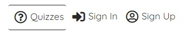
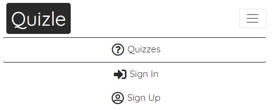
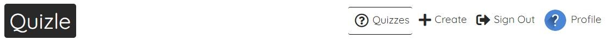

#### Search Bar

- The search bar features at the top of the Quizzes page, and includes title text showing which category of quizzes the user is currently on
- The search bar allows users to search the currently selected category of quizzes
- Search criteria is matched against quiz titles and the name of the creator
- When a search returns no results, this is communicated to the member via text that says 'No results found!' 

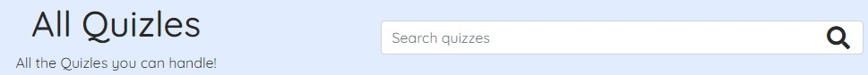

#### Filter Buttons

- Below the search bar are several buttons which allow a user to filter the quizzes by a specific category
- The buttons have a hover effect to show that they are interactive
- Clicking a button will filter the quizzes according to the specified category, and the title of the page will also update
- The buttons are contained within a 'Button Bar' component, this splits across 2 lines on smaller screen sizes

#### Quiz Tiles

- Underneath the search bar and buttons are the available quizzes that a user can complete
- Quizzes are automatically loaded upon accessing the page and are within an Infinite Scroll component that allows users to load more quizzes as they scroll
- Quiz information is contained within 'QuizTile' components which show an image representing the quiz category, the title of the quiz, the creator of the quiz and the number of likes it has received
- Quiz tiles change colour when the mouse is hovering over them to indicate that they link to a different page
- On smaller screens the quiz tiles are displayed in a single column instead of 2

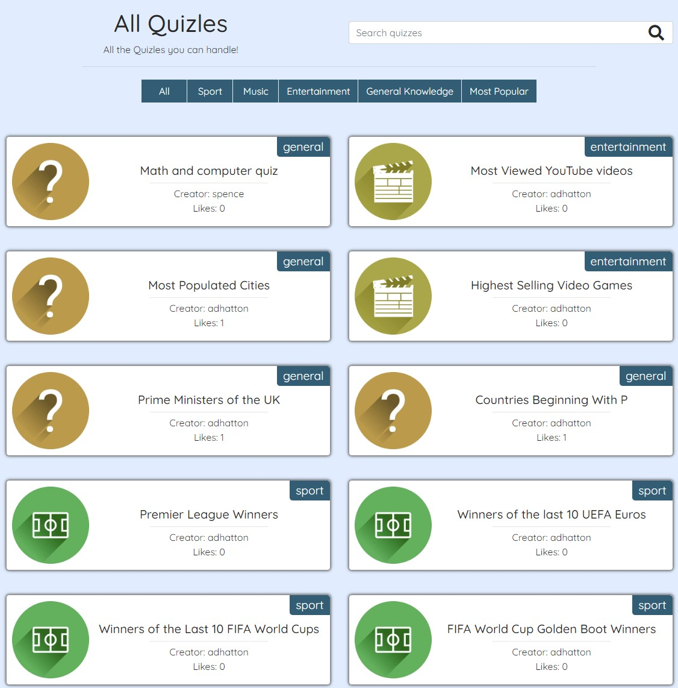

### Quiz Creation

#### Create Quiz

- When the user selects 'Create' from the Navbar, they are taken to a form for creating a quiz
- This form allows a user to create their own quiz by setting the different quiz information parameters, hints and answers
- The form contains some instructions to help users complete it
- There is standard validation on each field to ensure they are all completed, any errors in the form will produce a warning below the relevant field when the user tries to submit
- There are character limits on the title (50) and the description (255). The time limit must be between 30-600
- When a user submits a valid quiz they are taken to the Quiz page for it to give them immediate feedback that it has been created

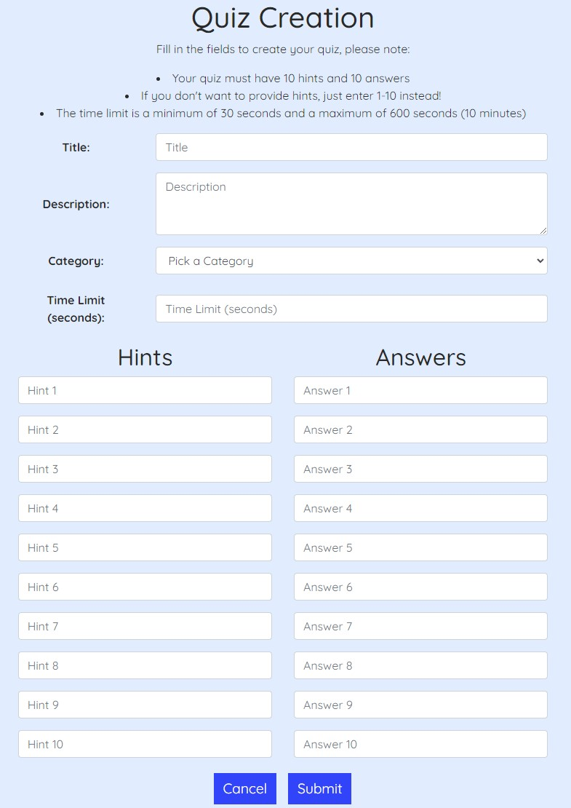

#### Edit Quiz

- The edit quiz form is the same as the create quiz form, but prepopulates the form with the existing quiz information
- When a user submits an edited quiz, they are given a modal to confirm that the update has been made. This is because if they have only made changes to the answers it would not be clear that these had been made when the user is redirected to the quiz page

### Quiz Page

- The Quiz Page forms the core functionality of the website and contains a number of important elements

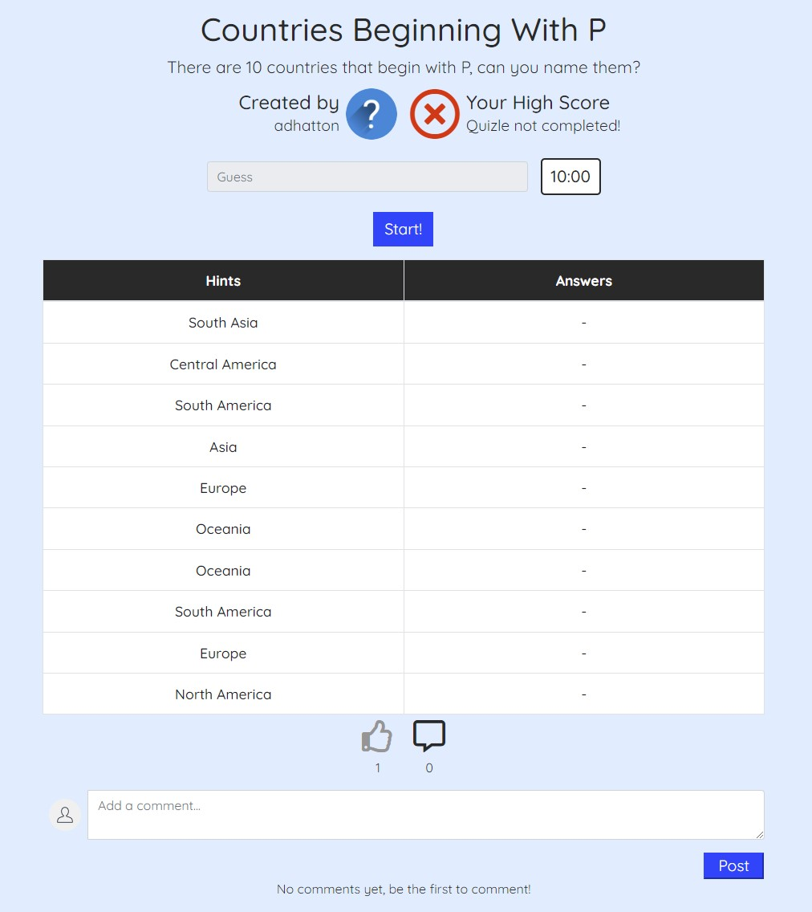

#### Quiz Info

- The quiz info shows the title and the description of the quiz to give the user a clear understanding of what they are trying to guess
- The creator's username is shown along with their profile avatar which links to the creator's profile. The username also has overflow applied to prevent long usernames affecting the styling
- The user's score is displayed and changes depending on context. For logged out users, it will show a grey icon and a message that they should login to access high score functionality. For logged in users it is a red cross if they haven't completed the quiz, and a green tick along with their fastest time if they have completed the quiz
- A quiz is only considered 'completed' if a user has guessed all the answers in any given attempt
- On smaller screens the profile and score information are placed at the bottom of the quiz so as to not distract from the main quiz elements

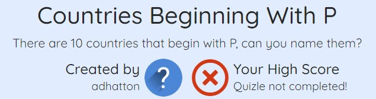

#### Quiz Dropdown

- If a user owns a quiz they are given a dropdown menu with additional actions
- If they select to edit a quiz, they are taken to the quiz edit form with the information prepopulated
- If they choose to delete a quiz, the quiz will be removed from the database and the user will be shown a modal confirming that the quiz has been deleted

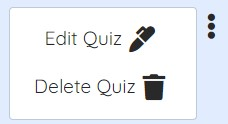

#### Guess Input

- Whilst the quiz is active, anything the user types in will be checked against the answers after every keystroke. If an answer is correct it will automatically be revealed without the user needing to press enter
- The guesses are automatically trimmed for whitespace and converted to lowercase before comparison
- Guessing an already guessed answer will have no impact. If an answer appears more than once in the quiz, guessing it once will reveal every instance. 
- There is back end validation to ensure guesses are only checked if the game is active
- These features mean that it is simple and intuitive for users to make guesses with minimal input

#### Controls and Timer
- To start a quiz the user must press start, at which point the timer will start counting down and the guess input will be activated
- Whilst the quiz is active, the button will change to 'Give Up?' which allows a user to end the quiz and reveal all the unguessed answers
- If the timer runs out, the game will be set to inactive and all the unguessed answers will be revealed
- If a user completes the quiz by guessing all the answers, the timer will stop and a score will be created for the user (this will automatically update the high score section)
- If a user has already completed a quiz and completes it again in a faster time, their high score will be updated
- If a user has given up, run out of time or completed the quiz, the button will change to 'Reset' which allows them to reset the quiz back to its initial state

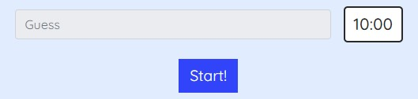

#### Answer table

- The answer table displays the hints for the quiz and any answers that have been guessed
- When an answer is guessed, an animation is triggered to reveal it and provide visual feedback that an answer is correct

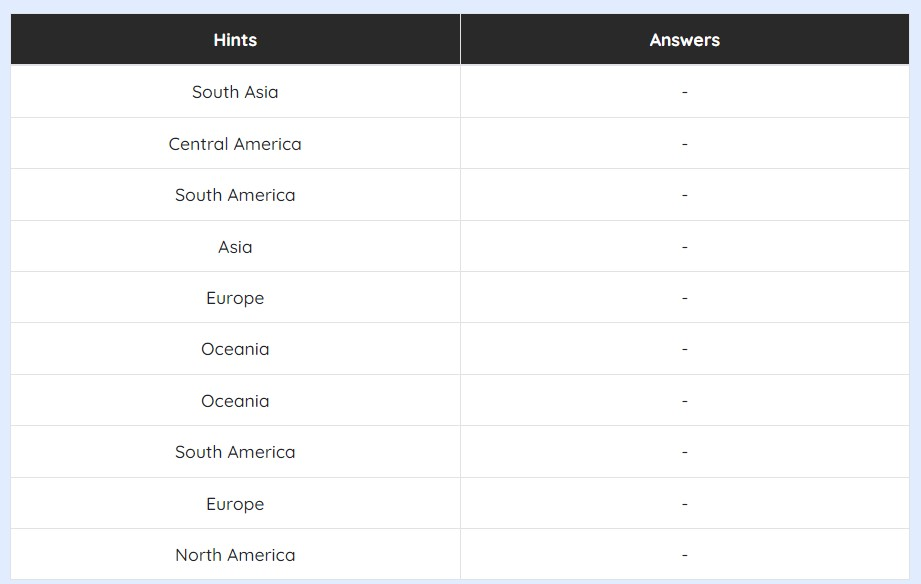

#### Likes Icon

- Below the answer table is a 'thumbs up' icon which enables a user to 'like' a quiz
- When the mouse is hovered over the icon it changes colour to orange to show it is interactive, and when it is clicked it changes colour to blue to represent that the quiz has been liked
- Liking a quiz will increment the like count by 1, and this is also displayed on the quiz tiles on the home page
- The quiz owner cannot like their own quiz and is shown a tooltip explaining this if they try
- Logged out users cannot like a quiz and are shown a tooltip explaining this which encourages them to sign up

#### Comments Icon

- Next to the likes icon is the comments icon which displays how many comments a quiz has
- When a comment is added the comment count will increase by 1

#### Comments

- At the bottom of the quiz page is the comments section which displays any comments that have been posted for the quiz
- For logged in users, a comment form is displayed. Users can complete the form and select 'Post' which will add the comment to the page
- Logged out users cannot see the comment form, but are able to see any comments that have been posted
- Logged in users can edit or delete any comments they have previously made using the drop down menu
- Editing or deleting a comment will cause an instant update to the interface

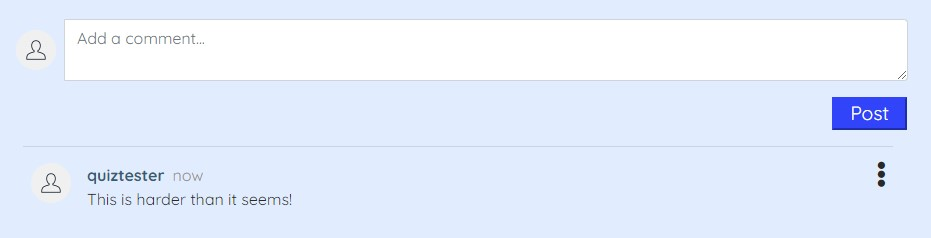
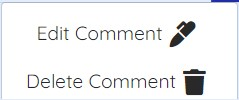

### Profile Page

#### Profile Info

- The user can access their profile by selecting 'Profile' from the Navbar. They can also access other user profiles via their avatars on comments and created quizzes
- The profile page shows information for the given user, including: username, name, created quizzes count, completed quizzes count and bio

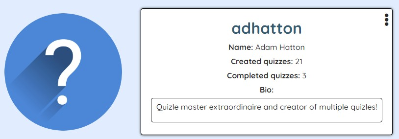

#### Created and Completed Quizzes

- Below the profile information, the user can see any quizzes they have created or completed in the form of quiz tiles
- The quiz tiles are implemented in an infinite scroll, so more are loaded as a user scrolls
- The button bar allows users to flip between completed and created quizzes

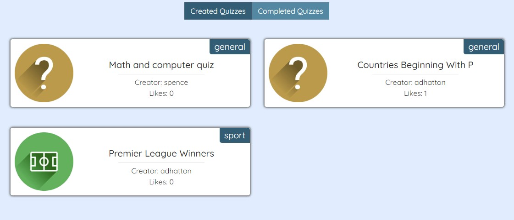

#### Edit Profile

- If a user owns a profile they are given a dropdown menu with additional actions
- Users can choose to edit their profile which will display a separate form where they can update their profile image, name and bio
- The form contains validation so that only image files can be uploaded for the profile image
- When a user makes a change and presses save, they are shown a confirmation message that their update has been made

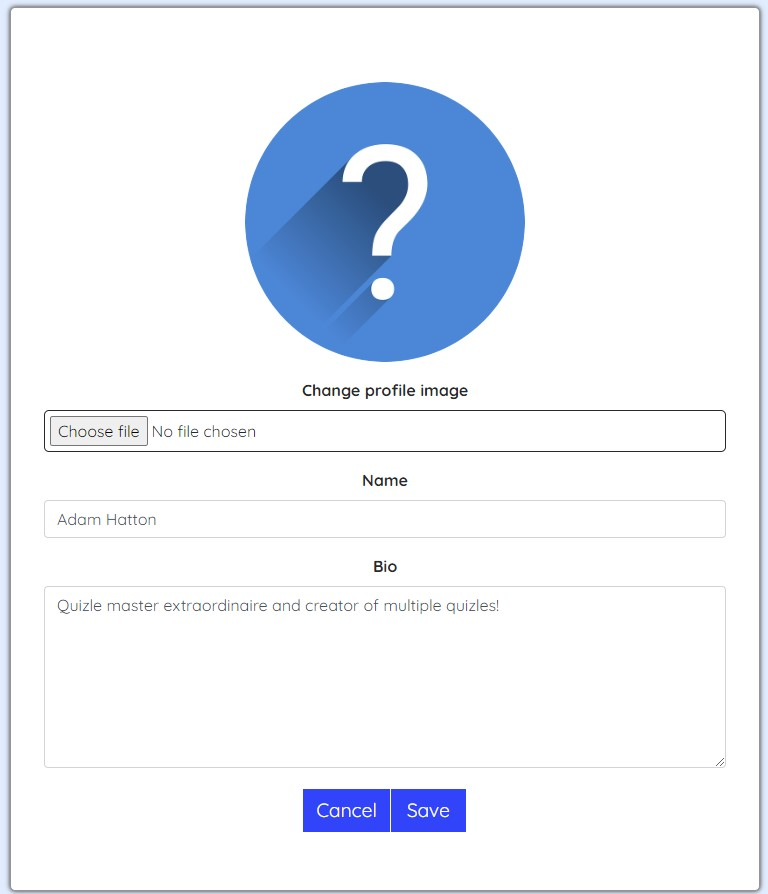

#### Edit Username

- If a user owns a profile they can choose to edit their username which will display a separate form
- When a user makes a change and presses save, they are shown a confirmation message that their update has been made

#### Edit Password

- If a user owns a profile they can choose to edit their password which will display a separate form
- When a user makes a change and presses save, they are shown a confirmation message that their update has been made

### Authorisation

#### Sign Up

- Users can create an account by accessing the 'Sign Up' page and completing the form
- The sign up screen has been styled to match the rest of the website and provides standard signing up functionality and validation
- Once an account has been created, users are redirected to the sign in page
- The form also contains a link directly to the sign in page for if a user already has an account

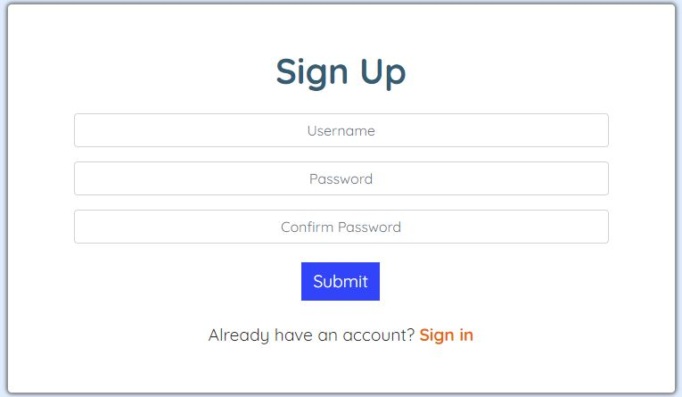

#### Sign In

- Users can use the sign in form to login to the website. This is handled using Django authentication and JSON Web Tokens
- The sign-in form has been styled to match the rest of the website and provides the standard sign in functionality
- The form also contains a link directly to the sign up page for if a user does not yet have an account

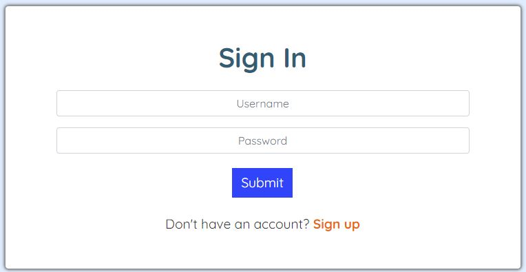

### General Features

#### Security

- In order to properly interact with the website, a user needs to have an account and be logged in. None of the following are possible unless a user is authorised: Creating and amending quizzes, adding comments, adding profile information, and liking quizzes. If an unauthorised user tries to access any information they are not authorised for they will be redirected

#### General

- For any edit actions where it may not be immediately clear that the change has been made in the database, a confirmation modal is displayed to give feedback to the user that their action has taken effect

#### 404

- If a user attempts to access a page that does not exist, they will be given a 404 page in line with standard user experience

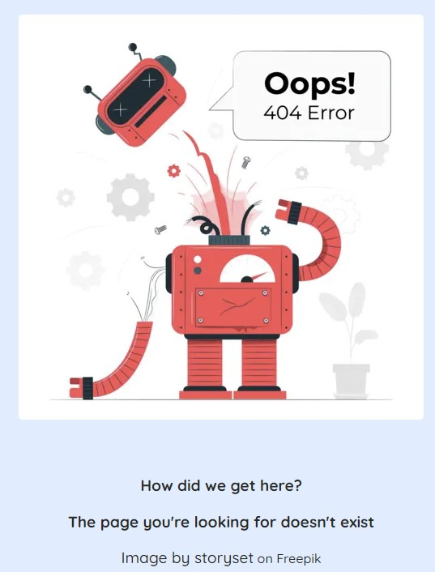

[Back to top ⇧](#quizle)

## Design

### Colours

The below colours have been used throughout the website:

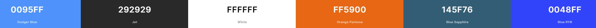

The base colours chosen were #292929 (a lightened black) and white in order to ensure a high level of contrast as well as keeping the display clean and simple.

#FF5900 has been used as the hover colour for various elements to indicate their interactivity as it is a nice bold colour to highlight points of attention.

#145F76 has been used for buttons which filter quizzes and for certain headings. This colour provides some variation for the darker coloured elements and provides a way of differentiating the purpose of certain buttons against other buttons.

#0048FF has been used for buttons which denote a user action of some kind (such as navigation or data creation/amendment). This blue works well with the other colours but provides a good level of contrast to make the buttons clearly visible on the page.

### Typography

The font used is 'Quicksand' with a fallback of sans-serif. This font is clean and easily readable, but provides a different feel to the standard bootstrap fonts. This font was chosen to prevent the site appearing too 'generic'.

### Imagery

There is limited imagery on the website and it is used as supporting content for the text:

- There are 4 images to reflect the category of a quiz: Sport, Music, Entertainment, General Knowledge. These are simple graphics and are used to make it easy to quickly identify a quizzes category
- A 404 image of a robot malfunctioning. This is used to provide a lighthearted notification that a page does not exist

The category images were taken from Pixabay.

The 404 image was taken from Freepik

### Wireframes

The wireframes for the website can be seen below, these were generated at the start of the project. Based on the user stories I had created, I determined that the website would have 4 main pages or sections:

- Home page for quizzes
- A quiz page for playing a quiz
- A creation/edit page for making a quiz
- A profile page

**Home Page**

The goal of this page is to display quizzes for selection, so I knew it needed to include search and filtering features, as well as an area to show the quizzes themselves. I decided to dedicate most of the screen to displaying 2 columns of quizzes (with the idea that infinite scroll would be enabled), and have the search/filter features at the top of the page. On mobile, the quizzes drop down to 1 column:

Main Page Wireframes

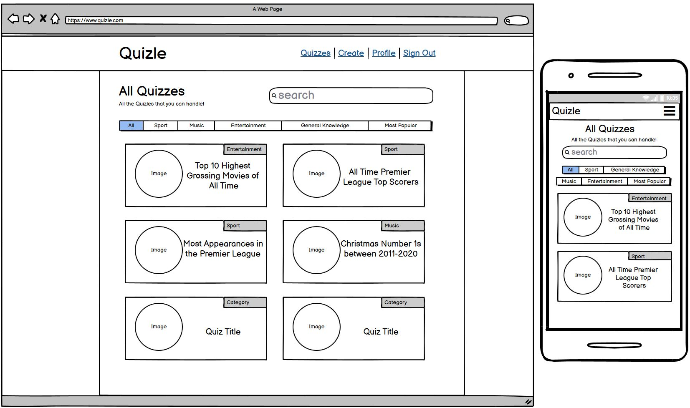

**Quiz Page**

This is the main page for actually interacting with the content. I wanted the main focus to be the quiz itself, so placed the answers table prominently in the middle of the screen and used the space above for information about the quiz. On mobile, the creator and high score drop below the answer table to make better use of the available space.

The final design of the Quiz page differs from the mockups. I moved the start button to be above the answers table, as on smaller screens it wasn't clear where it was, and it also ties it together with the timer and guess input better. In addition, the likes and comments feature were added to the bottom of the screen.

Quiz Page Wireframes

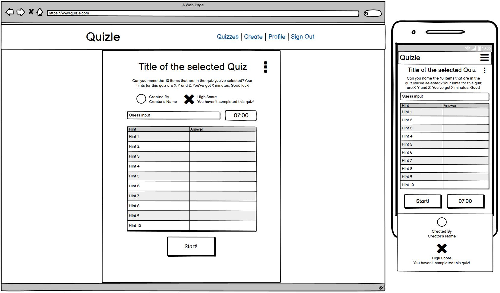

**Create/Edit Page**

I knew a page would be needed for creating quizzes and due to the amount of information that is required it would need to be quite a large form. I decided to dedicate a full page to the form rather than trying to include quiz creation elsewhere. Following this decision, it was a case of positioning the required input fields in a sensible order and also making sure there were some instructions to help guides users.

Create Quiz Wireframes

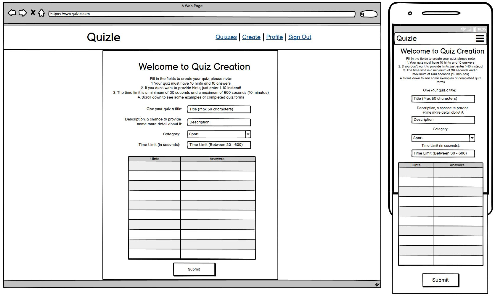

**Profile Page**

The goal of the profile page is to allow a user to see more information about themselves or another user, as well as to see their quiz stats. I positioned the user information prominently at the top so that it is easy to find, and used the bottom half of the page to display quizzes that the user has created or completed.

The final design differs slightly in that there was originally a middle section to show the number of quizzes a user had completed. I decided that this was using a lot of space for no real benefit, so I included it in the profile information instead.

Profile Page Wireframes

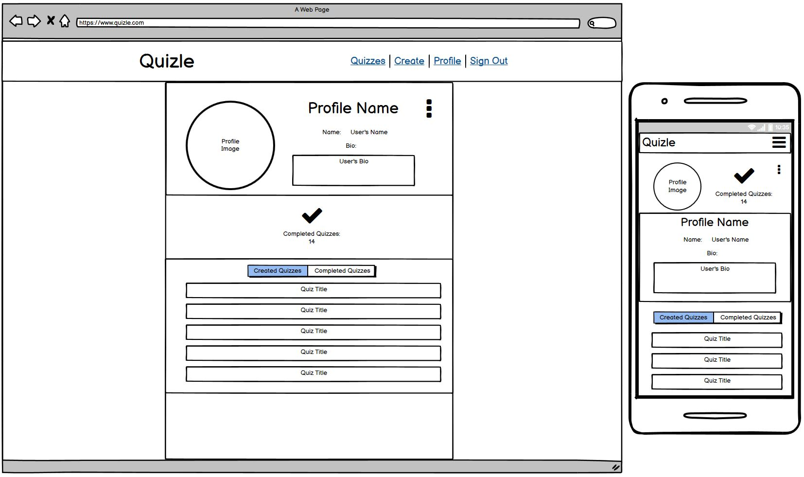

**Other Pages**

I also completed mockups for the Signup/Signin page and the Profile Edit page. These follow standard user experience for these types of forms. The design of the Profile Edit page changed slightly in that the flow was changed to be profile image before the name and bio fields.

Signup Wireframes

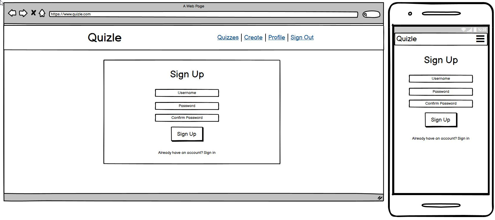

Profile Edit Wireframes

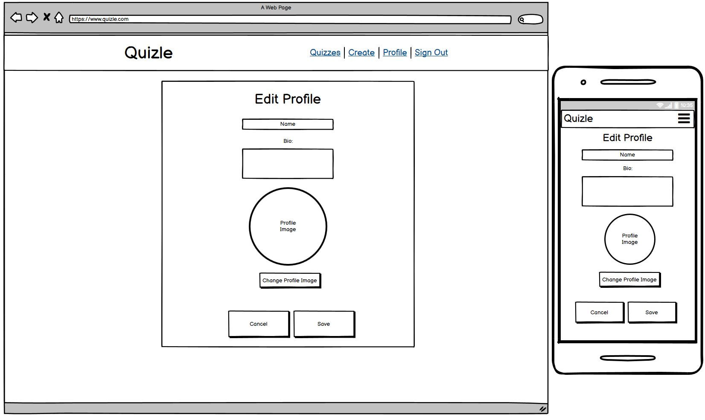

[Back to top ⇧](#quizle)

## Database Schema

The database schema is detailed in the repository for the back end of the website here: https://github.com/adamhatton/quizle-drf-api#database-schema

## React

### Components

As the front end of this website was built using ReactJS, a number of the components created are reusable:

- Asset.js - renders a loading spinner, or a question mark icon with a message. It is used in several places across the site, including showing a loading spinner where API calls are made, and in instances where no results are found to show a message to the user (such as an invalid search, or on a profile page for someone who has not completed any quizzes).
- Avatar.js - displays a user's profile image and some optional text. It is used in the Navbar, on the Quiz page next to the creator's name, in the comments component to show the user's profile image next to their comments, and on the profile page itself. There is an optional height property that allows it to be sized differently based on the use case.
- MessageModal.js - A pop-up modal that displays a confirmation message which has been passed as a property. It is used to confirm user actions in various places, such as submitting the Quiz Edit form, deleting a quiz, editing a profile, and changing a username/password.
- MoreDropdown.js - provides a dropdown menu with some additional actions a user can take, such as editing and deleting. This is used on the quiz page, the comments component, and on the profile page. It allows the owner of the relevant component to see the options for editing and deleting.
- Timer.js - renders a countdown timer based on a provided number of seconds and control properties. This component is only used within the Quiz component, but due to how it is designed it could theoretically be used elsewhere if a timer is needed.
- QuizTile.js - displays a tile containing the key information for a quiz that links to that quiz's page. This component is used on the Home page to display quizzes, and on the profile page to show quizzes that a user has created or completed.

### Libraries

This site uses a number of different libraries and components to implement the different features:

- axios - this is used to manage the calls to the database. It is used in order to simplify the API requests, as well as the fact that it includes interceptors for refreshing JSON Web Tokens which the site uses.
- react-bootstrap - this is used extensively to manage the layout and styling of the website. I am familiar with standard bootstrap so I chose to use this library to help implement the design of the site. The library makes it easy to create and use standard interface elements that are responsive as well as having useful styling classes to make arranging layouts simpler.
- jwt-decode - this is used to help remove requests to refresh an access token for logged out users. It enables the refresh token to be decoded so that a timestamp can be put in local storage, if a timestamp does not exist in the user's local storage then access refresh requests will not be made.
- infinite-scroll-component - this is used to enable infinite scrolling on the QuizTile components and on comments. Infinite scrolling is a standard feature of today's user experience and this component makes it very easy to implement which is why it has been included.
- react-router-dom - this library makes it easy to manage the site navigation without needing to refresh the page and so has been used to provide a quick and responsive user experience.

## Technologies

### Development Technologies

**Languages**
- [CSS](https://en.wikipedia.org/wiki/CSS)
- [HTML5](https://en.wikipedia.org/wiki/HTML5)
- [JavaScript](https://en.wikipedia.org/wiki/JavaScript)
- [React JSX](https://reactjs.org/docs/introducing-jsx.html)

**Frameworks & Libraries**
- [React Bootstrap4](https://react-bootstrap-v4.netlify.app/) - used for styling the site and making it responsive on different devices
- [ReactJS](https://reactjs.org/) - used to build the functionality of the site
- [Font Awesome](https://fontawesome.com/) - used to add various icons to the site

**Tools**
- [Balsamiq](https://balsamiq.com/) - used to create the initial wireframes of the website
- [Chrome DevTools](https://developer.chrome.com/docs/devtools/) - used throughout the process for testing the responsiveness of the website, debugging issues, experimenting with layout/style choices, and debugging JavaScript issues
- [Cloudconvert](https://cloudconvert.com/) - used to convert the images to .webp format
- [Coolors](https://coolors.co/) - used to obtain a visual chart of the colours used
- [Favicon](https://favicon.io/favicon-generator/) - used for creating a favicon for the site
- [Gitpod](https://www.gitpod.io/) - used to write and develop the website
- [Git](https://git-scm.com/) – used for version controlling by using the Gitpod terminal to commit to Git, and subsequently pushing to GitHub
- [GitHub](https://github.com/) – used to store the source code for the application
- [Heroku](https://www.heroku.com/) - used to host and deploy the live website
- [jpg2png](https://jpg2png.com/) - used for converting jpg files to png
- [Sessions colour picker](https://www.sessions.edu/color-calculator/) - used to help create a colour palette
- [Techsini](http://techsini.com/multi-mockup/) - used to generate a multi-device mockup (as seen at the beginning of the README)
- [TinyPNG](https://tinypng.com/) - used for reducing image file sizes

### Testing Technologies

- [ESLint](https://eslint.org/) - used for validating JSX code
- [Jigsaw CSS validator](https://jigsaw.w3.org/css-validator/) - used for validating the CSS code
- [JSHint](https://jshint.com/) - used for validating the JavaScript code
- [Lighthouse](https://developers.google.com/web/tools/lighthouse) - used for analysing the performance, accessibility, best practices and SEO of the website
- [WAVE Web Accessibility Evaluation Tool](https://wave.webaim.org/) - used for checking web accessibility

## Testing

The testing was broken down into two categories: manual and validation. A separate document detailing the testing can be found [here](TESTING.md), but a summary is below.

### Manual Testing

I manually tested the website on 3 different browsers: Chrome, Desktop, Edge. In addition I also tested it on my own mobile, and had a number of friends and family test it on their own devices.

This testing consisted of checking:

- The website functioned as expected
- All links were working
- Forms could be submitted
- Feedback messages were provided where expected
- The display updated correctly according to user's logged in status
- Interactive functionality works as expected
- Calls to the database work correctly

### Validation

I validated all aspects of my codes as follows:

- CSS via the [Jigsaw CSS validator](https://jigsaw.w3.org/css-validator/)
- JavaScript via [JSHint](https://jshint.com/)
- JSX via [ESLint](https://eslint.org/)
- Accessibility via the [WAVE Web Accessibility Evaluation Tool](https://wave.webaim.org/)
- Site performance via [Lighthouse](https://developers.google.com/web/tools/lighthouse)

**Note that for the JavaScript code, all console.log calls that appear in catch blocks have been left in but commented out. This has been done on the advice from the Code Institute Moments Walkthrough project that it is useful to keep them in for easier debugging**

[Back to top ⇧](#quizle)

## Bugs and Issues

### QuizTile Sizing

During testing I encountered a bug whereby when a search on the homepage only returned a single result, the QuizTile styling was broken and it displayed as a squashed column of vertical text. I initially attempted to fix this by adding a minimum width to the QuizTile component, but upon review I realised that the same issue was not occurring for QuizTiles that were returned on the Profile Page. By comparing the two components, I noticed that the Infinite Scroll component on the Quizzes Page was child to a bootstrap Row instead of a bootstrap Col so it was not taking up the full width as expected. I added a Col component to wrap the Infinite Scroll component and this fixed the issue.

### Multiple Score Creation Requests

When a user completes a quiz, a request is sent to the database to create a new score, but this first checks to see if a score_id exists in the current quiz props to determine whether a put request should actually be made:
~~~
const handleCreateScore = async (score) => {
// If user has not previously completed quiz, create a new score
if (!score_id) {
  try {
    const {data} = await axiosReq.post('/scores/', {
      quiz: id,
      completed_time: score,
    });
    setQuizInfo((prevQuiz) => ({
      ...prevQuiz,
      score_time: data.completed_time,
    }));
  } catch(err){
    //console.log(err);
  }
} 
// If user has previously completed quiz, update their score
else if (score < score_time) {
  //put request
}
~~~
If a score gets created, then the existing quizInfo gets updated with the new score information. However I noticed that 2 requests were getting made every time a new score was created, one which succeeded and then another which failed. After debugging the code I noticed that in the `setQuizInfo` call that I was not setting a `score_id` in the current `quizInfo` using the data from the response. As such, the useEffect would run again, see that there was no score_id and attempt to post another score object. To fix this, I made to sure to set the `score_id` of the current `quizInfo` from the response data:

~~~
setQuizInfo((prevQuiz) => ({
  ...prevQuiz,
  score_time: data.completed_time,
  score_id: data.id
}));
~~~

### Timer running out bug

During the user testing, one of my friends reported that when playing a quiz if the timer reached 0 nothing happened but the expected behaviour was for the missing answers to be revealed. The Quiz component contains a `useEffect` where a 'quiz completed' check is run every time there is a change in the dependency array, however I had forgotten to add a method of handling the timer reaching 0. To fix this I added a check into the `useEffect` for if the quiz was still active and the seconds had reached 0:
~~~
else if (seconds === 0 && quizActive){
  setCompleted(true);
  setQuizActive(false);
  setQuizAnswers(quizAnswers.map(answer => {
    return {...answer, revealed: true};
  }));
}
~~~

### Delete Quiz redirection bug

After deployment I found a bug whereby if a user created a quiz, immediately chose to edit that quiz, and then deleted it straight away after editing, they would be taken back to the edit quiz page but it would be blank due to the quiz no longer existing. This is because after a quiz is deleted, it pushes the user back to the previous page with `history.goBack();`, which in this case is the Edit Quiz page. To fix this, I changed it so that when a quiz is deleted the user gets pushed to the homepage with `history.push('/');` instead.

## Deployment

### ReactJS

This website is built using ReactJS, so having a React project set up is necessary for deployment.

1. To set up this project, a new GitHub repository was created and opened as a workspace in GitPod. I then ran the following commands:
~~~
npx create-react-app . --template git+https://github.com/Code-Institute-Org/cra-template-moments.git --use-npm
~~~

Note that a template was used here to ensure dependencies between different libraries worked correctly, it is also possible to create the project just using `npx create-react-app . --use-npm`

2. To test that the project has been created successfully, use the command:
~~~
npm start
~~~

3. For deployment to Heroku to work, it is necessary to have a Procfile. Create a 'Procfile' at the top level of your project, and add the following command into it:
~~~
web: serve -s build
~~~

4. In addition, ensure that the following line appears in the `scripts` section of the `package.json` file:
~~~
"heroku-prebuild": "npm install -g serve"
~~~

5. To enable the Heroku build to work, it is also necessary to specify the version of node in the `package.json` file. To determine your version of node, use the command:
~~~
node --version
~~~

6. Then add the version into the `package.json` file as a key/value pair in the top level object. For instance, for this project the following was added:
~~~
"engines": {
  "node": "16.18.1"
},
~~~

7. Once development is complete and ready for deployment, commit the changes and push them to Github using:
~~~
git add .
git commit -m '<commit message here>'
git push
~~~

### Heroku

Once a React project has been set up and developed, it can be deployed to Heroku using the following steps (this is how this project was deployed):

1.	Navigate to https://www.heroku.com/ and login
2.	In the top right corner, select ‘New’ then ‘Create new app’
3.	From the ‘Create New App’ screen, enter a unique App name and select Europe, then select ‘Create app’
4.	An app is created and the dashboard is shown, from here navigate to the 'Deploy' tab and from the ‘Deployment Method’ section, select ‘GitHub’
5.	Allow Heroku to connect to GitHub by selecting ‘Connect to GitHub’
6.	Search for the repository by entering the name of the GitHub repository to deploy and selecting search
7.	From the results, choose the relevant repository and select ‘Connect’. This will connect the GitHub repository to Heroku, but before deploying there are some further steps to take.
8.	Go to the Heroku app for the back end API linked to this project (for example, for this project it would be the quizle-drf-api app)
9.	Open the 'Settings' tab, and select 'Reveal Config Vars'
10.	Add 2 new Config Vars as follows (these will allow the front end to access the back end API from the development environment and the production environment):
    - Key: CLIENT_ORIGIN, Value: "your front end app url" (for example, for this project it would be CLIENT_ORIGIN: https://quizle-ah.herokuapp.com)
    - Key: CLIENT_ORIGIN_DEV, Value: "your development url" (for example, CLIENT_ORIGIN_DEV: https://3000-adamhatton-quizle-uniquecode.gitpod.io/)
11.	Return to the Heroku app for the front end, and go back to the 'Deploy' tab
12.	In the 'Manual Deploy' section, select 'Deploy Branch'
13.	When the branch is manually deployed, Heroku will build and deploy the branch. Upon completion, a link to the deployed project will be generated

## Credits and Resources

### Code

- Much of the base code and concepts were provided in the Code Institute Walkthrough Project 'Moments' and these have been expanded on in this project. I have attributed the code from the Moments project with comments in .js files.
- In order to fix an error with React trying to update state on an unmounted component I used the method suggested by Dzmitry Kulahin on [this post](https://stackoverflow.com/questions/54954385/react-useeffect-causing-cant-perform-a-react-state-update-on-an-unmounted-comp). I have also added comments in the code to credit Dzmitry Kulahin
- When building the Timer component, I used the code from [this post by James Dietrich](https://upmostly.com/tutorials/build-a-react-timer-component-using-hooks). Whilst the code has been amended, the core concept was taken from the post.

### Learning Resources

Below are resources I used to further my understanding of different topics. The resources helped me learn new concepts that I could apply myself rather than being a 'copy and paste' solution:

#### Videos

- React useRef and forwardRef [YouTube video by Fullstack Simplified](https://www.youtube.com/watch?v=gwFfzIaKnAU)

#### Websites

- Learning about Flexbox flexwrap [Article by Chris Coyier](https://css-tricks.com/almanac/properties/f/flex-wrap/)
- Learning about column widths in Flexbox [Article by Kevin Powell](https://css-tricks.com/equal-columns-with-flexbox-its-more-complicated-than-you-might-think/)

### Content

- All non-quiz content was written by the developer (Adam Hatton)
- Quiz answers were taken predominantly from [Wikipedia](https://en.wikipedia.org/wiki/Main_Page) but the following sites were used for the answers of other quizzes:
    - Most Oscars - [goldderby](https://www.goldderby.com/gallery/movies-most-oscars-won/most-oscar-wins-lord-of-the-rings-return-of-the-king/)
    - UK Prime Ministers - [gov.uk](https://www.gov.uk/government/history/past-prime-ministers)
    - Countries beginning with P - [the world bank](https://data.worldbank.org/country)
    - Best Selling ABBA singles - [official charts](https://www.officialcharts.com/chart-news/abbas-official-top-20-biggest-songs__26113/)
    - Various Premier League quizzes - [premier league](https://www.premierleague.com/stats/all-time)

### Media

- The default profile image was taken from [Pixabay user raphaelsilva](https://pixabay.com/vectors/user-icon-person-personal-about-me-2935527/). Credit has also been given in the back end code where this image is used
- The QuizTile icons were taken from [Pixabay user IO-images](https://pixabay.com/users/io-images-1096650/). Credit for this user has also been given in Utils.js component where the image to use is determined
- The 404 image was taken from [Freepik](https://www.freepik.com/free-vector/oops-404-error-with-broken-robot-concept-illustration_7967793.htm#query=404%20not%20found&position=15&from_view=search&track=sph). Attribution has been given directly beneath the image in the actual display

### Acknowledgements

- I'd like to thank my partner Nichola for helping to amend the colours of the images, for helping me test the finished project, and for encouraging me through the development process!
- I'd like to thank my mentor Spencer Barriball for his feedback on the project and suggestions for improvement

[Back to top ⇧](#quizle)