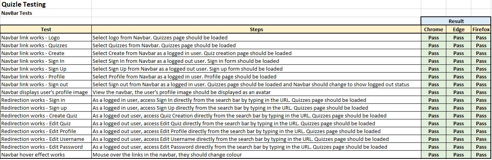
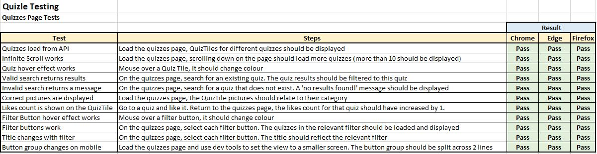
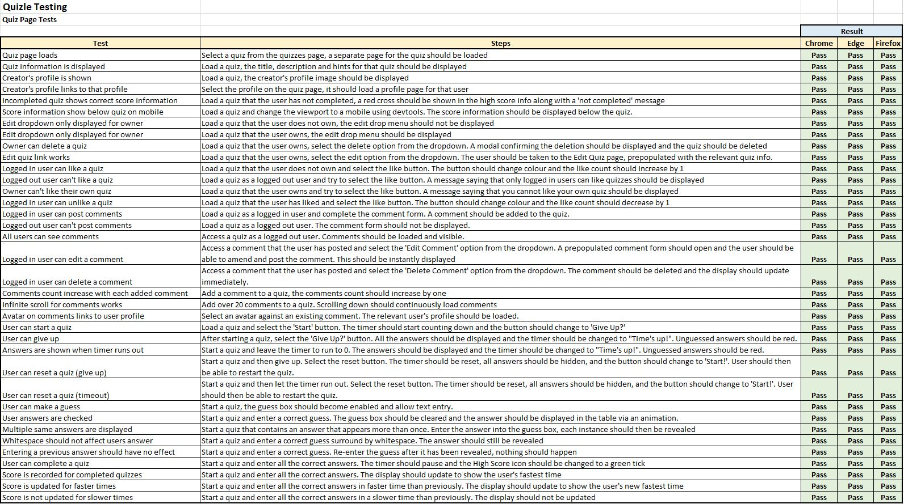
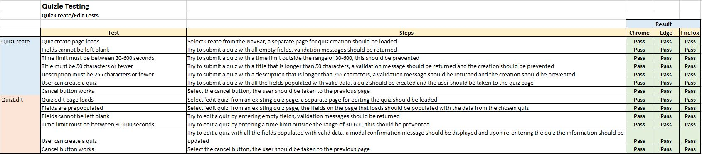
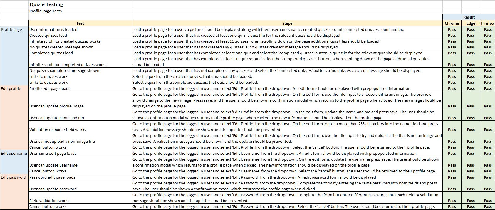
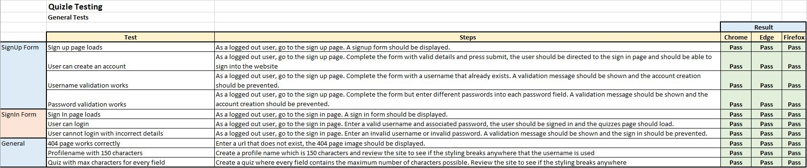
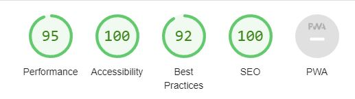
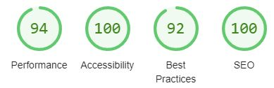
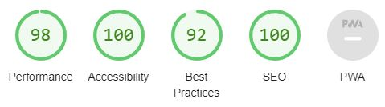
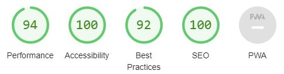

# Quizle - Testing

## Table of Contents
- [Manual Testing](<#manual-testing>)
- [Validation](<#validation>)
	- [CSS](<#css>)
	- [JavaScript](<#javascript>)
	- [JSX](<#jsx>)
	- [Accessibility](<#accessibility>)
	- [Performance](<#performance>)

## Manual Testing

The manual testing can be seen in the [manual testing spreadsheet](docs/testing/quizle-frontend-testing.xlsx).

I performed manual testing of the site on a variety of browsers on desktop (Chrome, Firefox, Edge), and on Chrome on my mobile device.

In addition, I shared the website with numerous friends and family for user testing on different devices.

The specific tests performed are below:

Navbar Tests

Quizzes Page tests

Quiz Page tests

Quiz Create tests

Profile Page tests

General tests

## Validation

### CSS

I ran each CSS module file through the Jigsaw CSS Validator, and this returned no errors for any files.

For the Button.module.css file it returned warnings that the border colour was the same as the background colour, however this was intentional in order to override the default colour of the bootstrap styling.

### JavaScript

The JavaScript code was run through JSHint configured to 'assume new JavaScript features (ES6)'. I performed this step primarily for syntax issues due to JSHint being unable to handle JSX code.

As such, the results from this mainly helped me tidy up my code formatting and input missing semicolons rather than identifying any problems.

### JSX

I passed each .js file through the ESLint playground with the following configuration:

- ESLint Version: v8.28.0
- ECMA Version: Latest
- Source Type: Module
- ECMA Features: JSX
- Environments: Browser, es6, es2021
- Rules: Default rules provided by eslint playground

All files produced a 'no-unused-vars' error for every import in each module despite the linter being configured to JSX. As these errors were being returned due to the imports being used in the JSX code, I ignored them.

No other errors were produced. 

### Accessibility

Each page was assessed using the WAVE accessibility tool. On the first pass this produced a couple of errors relating to missing labels for inputs, but after fixing these the second pass did not produce any errors or any contrast errors.

### Performance

To validate the performance I ran the following pages through Lighthouse:

- Quizzes Page
- Quiz Page
- Create Quiz Page
- Profile Page

The only issue identified was on the Quiz page where Lighthouse highlighted a contrast issue that was not picked up by the WAVE tool. The colour of the date text in the comments did not have a high enough contrast, so I changed this to a blue colour with a sharper contrast.

After fixing the issue, the results were as follows:

- Performance is in the mid 90s for all tested pages
- Accessibility is 100 for all tested pages
- Best Practices is 92 for all tested pages, but this appears to be do with using React
- SEO is 100 for all tested pages

Screenshots of the results can be seen below:

Quizzes Page

Quiz Page

Create Page

Profile Page

